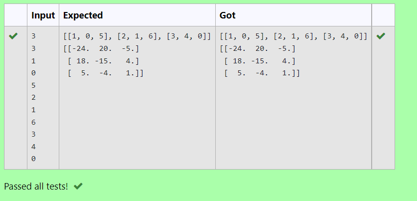

# Inverse-of-matrix

## AIM: 
     To inverse the matrix.

## ALGORITHM:
### Step 1: Import numpy as np.
### Step 2: Create an empty list.
### Step 3: Get inputs from the user.
### Step 4: Use inverse function.
### Step 5: Run and End the program.

## PROGRAM:
import numpy as np

no_of_col, no_of_row = int(input()),int(input())

l1,l2 = [],[]

for i in range(no_of_row):

    for j in range(no_of_col):
        l1.append(int(input()))
    l2.append(l1)
    l1=[]
print(l2)

value1 = np.array(l2)

inverse = np.linalg.inv(value1)

print(inverse)    
    

## OUTPUT:

## RESULT:
Inverse of a matrix is successfully completed.
